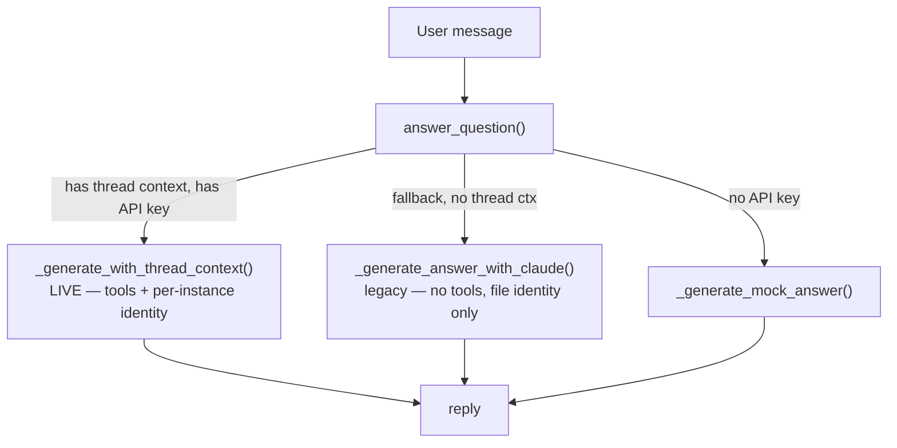
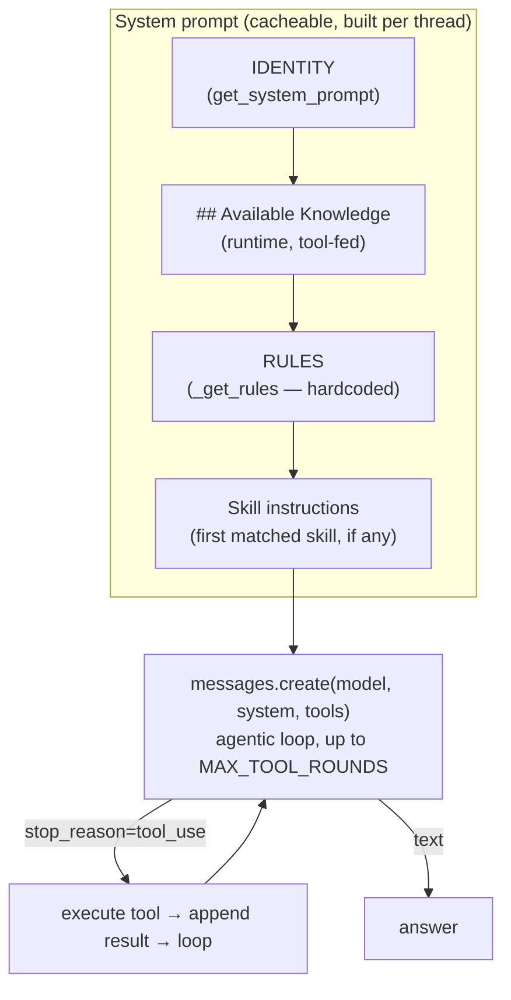
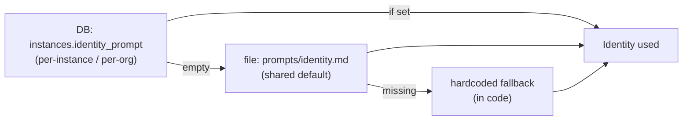
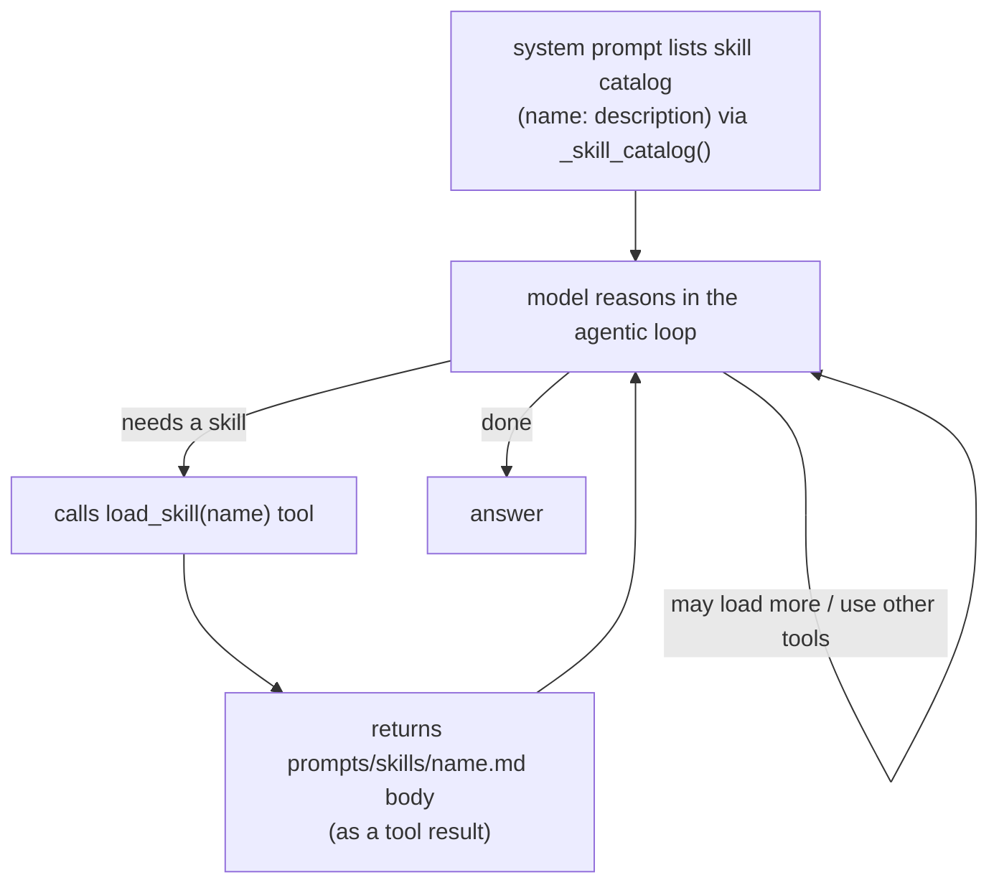

# Amebo prompt architecture

Map of every prompt that shapes how amebo talks and decides — what each layer is,
where it lives, which code path uses it, and what's editable as a file vs. in code.
Edit the files in this folder directly; the in-code prompts are noted with pointers.

> TL;DR layers: **Identity** (who/purpose) → **Rules** (always-on) → **Skill**
> (task-specific, keyword-triggered) → **Knowledge** (runtime). Plus separate
> prompts for the **claw** and **intentions** paths.

---

## 1. Which answer path runs

`QAService.answer_question()` picks a path. Chat (web) and Slack both land on the
**agentic path** (the live one, with tools).



Pointers: [`../src/services/qa_service.py`](../src/services/qa_service.py) —
`answer_question`, `_generate_with_thread_context` (live), `_generate_answer_with_claude` (fallback).

---

## 2. How the system prompt is assembled (live agentic path)



Built in [`../src/services/conversation_manager.py`](../src/services/conversation_manager.py)
(`build_messages`) + skill append in
[`../src/services/qa_service.py`](../src/services/qa_service.py) (`_generate_with_thread_context`).
Model is config-by-instance via `AMEBO_QA_MODEL` (env).

---

## 3. Identity precedence (the "who/purpose")



- **Per-instance (per-org):** DB column `instances.identity_prompt`. Instance 1
  (whatscookin / LinkedTrust) is currently **empty** → it uses the file. This is
  the clean place for one org's voice without touching the shared default.
- **Default file:** [`identity.md`](identity.md) ← edit this for the global voice.
- **Hardcoded fallbacks:** `get_system_prompt()` in conversation_manager, and a
  second loader `_load_identity_prompt()` in qa_service.

> ⚠️ **Wrinkle — two identity loaders.** The **live agentic path** reads
> `instances.identity_prompt` (then the file). The **legacy fallback path**
> (`_generate_answer_with_claude` → `_load_identity_prompt`) reads the **file
> only** and ignores the per-instance prompt. So a per-instance prompt won't
> apply on the fallback path. Worth unifying.

---

## 4. Skills (task-specific, keyword-triggered)

Amebo now uses **model-driven selection** (Claude-Code-style progressive
disclosure): the system prompt lists the skill **catalog** (name + description),
and the model calls the **`load_skill(name)`** tool during the agentic loop to
pull full instructions for the skill(s) it picks — so it can choose and **chain**
several. (The old keyword/regex first-match, `_match_skill`, remains only for the
legacy non-agentic fallback path.)



Skill file format ([`skills/who-knows.md`](skills/who-knows.md) is a good example):

```markdown
---
name: who-knows
description: Find people connected to a topic
triggers:
  - "who knows about"
  - "how is .* related"      # substring OR regex
search_strategy: bindings_first
---
<body: the instructions injected when a trigger matches>
```

Current skills: [`goals`](skills/goals.md) · [`rank-opportunities`](skills/rank-opportunities.md)
· [`relationship-map`](skills/relationship-map.md) · [`status-update`](skills/status-update.md)
· [`who-knows`](skills/who-knows.md). Add a skill = drop a new `.md` here.

> ✅ **Model-driven now:** the model can load **multiple** skills (and combine
> them with other tools) via `load_skill`. Add a skill = drop a new `.md` here
> with a clear `description` (that's what the model sees in the catalog) — no
> code change needed.

---

## 5. Every prompt surface (full inventory)

| Layer | Where to edit | Used by | File or code? |
|---|---|---|---|
| Identity — per-instance/org | DB `instances.identity_prompt` | live QA path + claws | DB (admin) |
| Identity — default voice | [`identity.md`](identity.md) | QA when no instance prompt; fallback path always | **file** |
| Identity — hardcoded fallbacks | `get_system_prompt()` / `_load_identity_prompt()` | last resort | code |
| Rules (always-on) | `_get_rules()` in [conversation_manager.py](../src/services/conversation_manager.py) | live QA path | **code** (not a file) |
| Skills | [`skills/*.md`](skills/) | both QA paths | **files** |
| Claw / goal pursuit | `_build_system_prompt()` in [goal_dispatcher.py](../src/services/goal_dispatcher.py) (uses instance identity + goal framing) | autonomous claws | code |
| Intentions / abra placement | `_SYSTEM_PROMPT` in [intentions_service.py](../src/services/intentions_service.py) | `<amebo-create-goal>` embed | code |

---

## 6. Things worth deciding (flagged, not changed)

1. **Unify the two identity loaders** so the per-instance prompt always wins
   (today the legacy fallback path ignores it).
2. **Move Rules out of code into a file** (e.g. `rules.md`) so they're editable
   here like everything else.
3. ~~Richer skill selection~~ ✅ **Done** — model-driven selection + chaining via
   `load_skill` (catalog in the system prompt, full skill loaded on demand).
   Optional skill *scripts*/sandboxing remain unimplemented (not needed for now).
